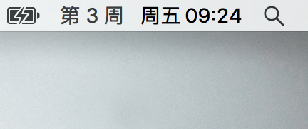

# WeekCount

&nbsp;&nbsp;&nbsp;&nbsp;&nbsp;&nbsp;[](https://travis-ci.org/JeziL/WeekCount)&nbsp;&nbsp;&nbsp;[](https://codeclimate.com/github/JeziL/WeekCount)&nbsp;&nbsp;&nbsp;[](https://raw.githubusercontent.com/JeziL/WeekCount/master/LICENSE)



终于不用再说出「第几周了？！」这个愚蠢的问题。

第一个 Swift 项目，写了两句代码，做了一点微小的工作，向今晚的 WWDC 2016 献礼。

[最新版下载](https://raw.githubusercontent.com/JeziL/WeekCount/master/releases/WeekCount_latest.zip)

##设置


- `显示格式` 一栏可以自定义显示在状态栏上的样式，使用 `{W}` 代表周数（阿拉伯数字）、`{zhW}` 代表中文大写的周数，还支持 ISO8601 标记（如 `yyyy-MM-dd` 等）；
- `学期共` 和 `字体大小` 两栏里不要试图写不是数字的东西，否则将受到上天的惩罚。

## URL Schemes

WeekCount 有一套完整的 URL Schemes 支持，可通过 [Alfred](https://www.alfredapp.com/) 调用。


具体调用方法为（以下所有 `wc://` 替换成 `weekcount://` 也是可以的）：

- 打开设置面板：

	```
	wc://
	```

- 重置设置项为默认值：

	```
	wc://reset
	```
	
- 退出 WeekCount：

	```
	wc://quit
	```
	
- 更改设置项：

	```
	wc://set?startDate=20160222&lastCount=18
	---
	参数说明:
	- startDate: 学期开始时间，必须是 yyyyMMdd 格式
	- lastCount: 学期周数
	```
	
	以上两个参数只传其中任意一个也是可以的，一个不传（`wc://set`）也会打开设置面板。

## 其他

- 在 OS X El Capitan 及更早的系统版本里，App 在状态栏上的位置无法改动。为了更好的显示效果，我使用了一个私有 API 将它固定在系统时钟出现的位置，因此如果在 `系统偏好设置-日期与时间-时钟` 这里关掉状态栏上的时间显示，同时把 WeekCount 的显示格式设置成 `第 {W} 周 EEEE HH:mm`，效果上就可以完全替代系统的时钟；另据说 macOS Sierra 已经原生支持通过按住 `command` 键拖动来调整，如属实，在其正式版发布后会用 Swift 3 重写项目，然后移除这个私有 API。

- 一周的第一天是周一还是周日取决于系统设置，可在 `系统偏好设置-语言与地区-每周的第一天` 这里改动，改完可能需要重启一下 WeekCount；

- 开机启动依然是从系统设置里添加，在 `系统偏好设置-用户与群组-登录项` 这里。

## Release Note

- v1.1.0

	- 在`显示格式`中可以使用 `{zhW}` 显示中文大写周数；
	- 在`显示格式`中可以使用 IS08601 标记来显示日期和时间；
	- 现在 WeekCount 将出现在状态栏右侧紧靠 Spotlight 图标处；
	- 增加关于界面。

- v1.0.3

	- 修复在系统设置中修改一周的第一天后可能没有效果的 Bug。

- v1.0.2

	- 修复当设置项内容不合法时应用无限崩溃的 Bug，上天的惩罚不那么严重了；
	- 增加 URL Schemes 支持，参见 [URL Schemes](#url-schemes)。

- v1.0.1

  - 修复不刷新的 Bug（幸亏没过一个周才发现）；
  - 当前日期不在学期中的时候，由显示空调整为显示 `WeekCount`，以防找不到按钮。

