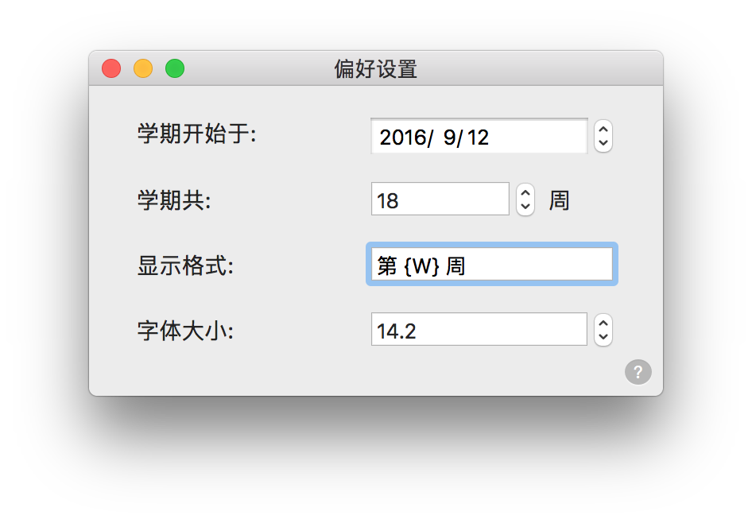

# WeekCount

终于不用再说出「第几周了？！」这个愚蠢的问题。

第一个 Swift 项目，写了两句代码，做了一点微小的工作，向今晚的 WWDC 2016 献礼。

[最新版下载](https://raw.githubusercontent.com/JeziL/WeekCount/master/releases/WeekCount_latest.zip)

##设置

- `显示格式` 一栏可以自定义显示在状态栏上的样式，使用 `{W}` 代表周数；
- `学期共` 和 `字体大小` 两栏里不要试图写不是数字的东西，否则将受到上天的惩罚。

## 其他

- 按住 `Command` 键就可以拖动它在状态栏上的位置；

- 一周的第一天是周一还是周日取决于系统设置，可在 `系统偏好设置-语言与地区-每周的第一天` 这里改动，改完可能需要重启一下 WeekCount；

- 开机启动依然是从系统设置里添加，在 `系统偏好设置-用户与群组-登录项` 这里。

